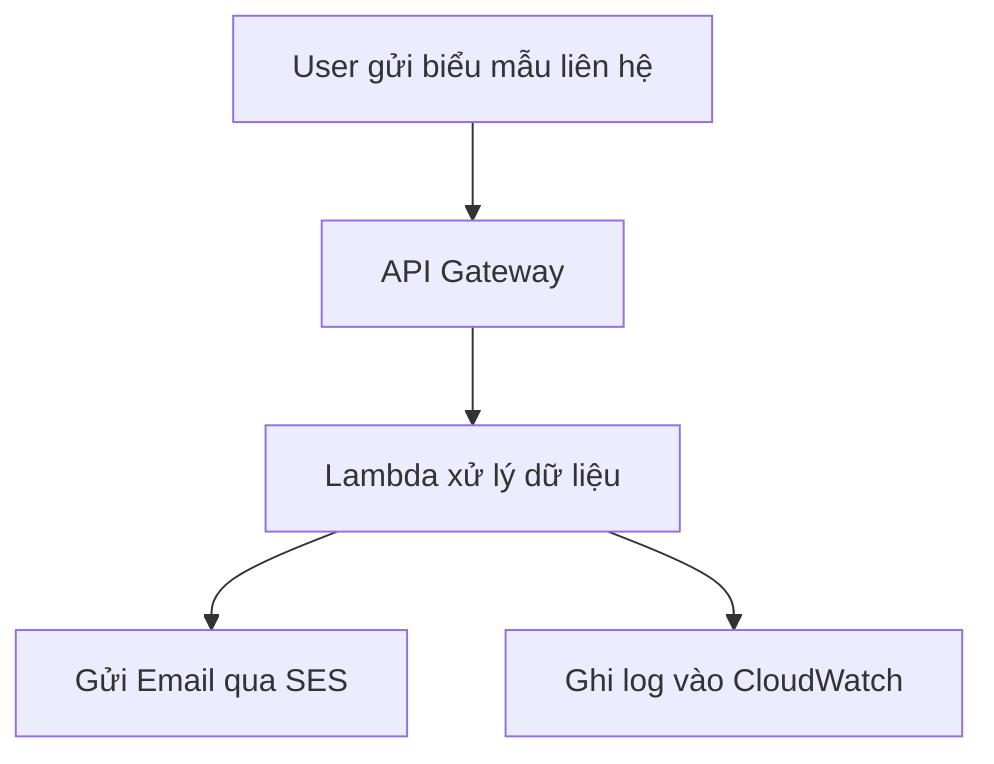

---
# 📄 Tạo Website Tĩnh Tích Hợp Gửi Email bằng AWS Serverless

---

🔷 Thông tin sinh viên

🧑‍🎓 Họ và tên: Phạm Ngọc Tình Anh

🆔 MSSV: 2180600060

📧 Email: phamngoctinhanh@gmail.com

🏫 Trường: Đại học Công nghệ TP.HCM (HUTECH)

📅 Ngày thực hiện: 09/07/2025

---
## 1. 📄 Tóm tắt điều hành (Executive Summary)

Trong thời đại số hóa mạnh mẽ, việc tương tác trực tiếp với người dùng qua biểu mẫu liên hệ là nhu cầu thiết yếu trên mọi website. Tuy nhiên, các website tĩnh thông thường lại không hỗ trợ tính năng gửi email, làm giảm đáng kể hiệu quả tiếp cận khách hàng. Để giải quyết bài toán này mà không phải xây dựng hệ thống backend phức tạp, chúng tôi đề xuất một giải pháp tích hợp gửi email bằng kiến trúc AWS Serverless.

### Mục tiêu dự án

* Phát triển website tĩnh có biểu mẫu liên hệ.
* Khi người dùng gửi form, dữ liệu được xử lý qua Lambda và gửi qua email bằng Amazon SES.
* Không sử dụng máy chủ, đảm bảo chi phí thấp, bảo mật cao và khả năng mở rộng tự động.

### Các tính năng chính

* Giao diện tĩnh sử dụng HTML/CSS/JS.
* Tích hợp API Gateway và AWS Lambda để xử lý dữ liệu.
* Dùng Amazon SES để gửi email.
* Giám sát toàn hệ thống bằng CloudWatch.

### Lợi ích kinh doanh

* Giảm chi phí vận hành tới 90%.
* Nâng cao trải nghiệm người dùng với phản hồi tự động.
* Không cần bảo trì backend, dễ mở rộng và tích hợp với các hệ thống khác.

### Thời gian & Chi phí

* Triển khai trong vòng 7 ngày.
* Chi phí duy trì dưới 5 USD/tháng nếu dùng AWS Free Tier.

### Kết quả mong đợi

* Tỷ lệ gửi email thành công >99%.
* Thời gian phản hồi dưới 3 giây.
* Tăng 20–30% tương tác từ người dùng truy cập.

---

## 2. 🎯 Tuyên bố vấn đề (Problem Statement)

### Hiện trạng và thách thức

Nhiều cá nhân, tổ chức và doanh nghiệp nhỏ hiện đang sử dụng website tĩnh để tiết kiệm chi phí. Tuy nhiên, các website này không thể gửi email phản hồi từ biểu mẫu liên hệ vì thiếu backend xử lý. Giải pháp phổ biến là sử dụng dịch vụ bên ngoài hoặc viết server-side code riêng, nhưng những phương pháp này có nhược điểm:

* Tốn kém chi phí vận hành máy chủ.
* Phức tạp về bảo mật và bảo trì.
* Thiếu khả năng mở rộng linh hoạt.

### Tác động kinh doanh

| Vấn đề                      | Tác động                                                         |
| --------------------------- | ---------------------------------------------------------------- |
| Không gửi được email        | Giảm tương tác khách hàng, mất cơ hội thu hút leads              |
| Thiếu giám sát              | Không phát hiện được lỗi, làm giảm độ tin cậy hệ thống           |
| Phụ thuộc vào dịch vụ thứ 3 | Mất kiểm soát dữ liệu, vi phạm quy định bảo mật của doanh nghiệp |

### Các bên liên quan

| Đối tượng                | Lợi ích/Kỳ vọng                                                          |
| ------------------------ | ------------------------------------------------------------------------ |
| Người dùng cuối          | Gửi phản hồi và liên hệ dễ dàng, không lỗi kỹ thuật                      |
| Chủ website/doanh nghiệp | Tăng tỉ lệ thu hút khách hàng tiềm năng, nâng cao hình ảnh chuyên nghiệp |
| Nhóm phát triển          | Không cần vận hành server, triển khai nhanh chóng                        |

### Cơ hội

* Xu hướng dịch chuyển sang serverless, tiết kiệm chi phí.
* AWS cung cấp bộ công cụ mạnh mẽ như Lambda, SES, API Gateway hỗ trợ tích hợp nhanh chóng.
* Giải pháp có thể mở rộng sang nhiều hệ thống khác với chi phí gần như bằng 0.

---

## 3. 🏗️ Kiến trúc giải pháp (Solution Architecture)

### Tổng quan hệ thống

Hệ thống bao gồm frontend được lưu trữ tĩnh trên Amazon S3, biểu mẫu gửi dữ liệu đến một REST API (API Gateway), hàm Lambda xử lý dữ liệu và sử dụng Amazon SES để gửi email. Logs và lỗi được lưu vào Amazon CloudWatch.

### Sơ đồ kiến trúc

### Thành phần chi tiết

| Thành phần        | Mô tả                                     |
| ----------------- | ----------------------------------------- |
| Amazon S3         | Lưu trữ và phân phối website tĩnh         |
| API Gateway       | Tạo endpoint RESTful nhận request từ form |
| AWS Lambda        | Hàm xử lý dữ liệu, gửi email và ghi log   |
| Amazon SES        | Dịch vụ gửi email bảo mật, hiệu quả cao   |
| IAM Role          | Quản lý quyền truy cập giữa Lambda và SES |
| Amazon CloudWatch | Theo dõi, log lỗi, cảnh báo bất thường    |

### Tính bảo mật và hiệu suất

* CORS chỉ cho phép domain hợp lệ gửi request.
* IAM áp dụng nguyên tắc phân quyền tối thiểu.
* Email gửi từ địa chỉ đã xác minh bằng SPF/DKIM.
* Lambda có thể mở rộng tự động theo lưu lượng truy cập.

### Tính mở rộng

* Tích hợp dễ dàng với CRM hoặc Zapier để lưu khách hàng.
* Có thể bổ sung xác thực Captcha, lưu dữ liệu vào DynamoDB.
* Phát triển thành hệ thống phản hồi tự động hoặc chăm sóc khách hàng.

---

## 4. 🔧 Triển khai kỹ thuật (Technical Implementation)
### 📌 Giai đoạn 1: Phát triển frontend (Website tĩnh)

* Thiết kế giao diện HTML/CSS với form liên hệ (Tên, Email, Nội dung).
* Tối ưu trải nghiệm người dùng (responsive design).
* Triển khai lên Amazon S3 với quyền public-read.
* Cấu hình CloudFront (nếu có) để tăng tốc độ truy cập toàn cầu.

### 📌 Giai đoạn 2: Thiết lập backend serverless

* Tạo REST API bằng API Gateway để nhận dữ liệu POST từ biểu mẫu.
* Viết Lambda function (Node.js hoặc Python) để xử lý form và gọi Amazon SES gửi email.
* Cấu hình IAM Role giới hạn quyền Lambda chỉ được phép gọi SES.
* Thiết lập Amazon SES với địa chỉ gửi email đã được xác minh.

### 🧪 Kiểm thử và triển khai

* Kiểm thử API Gateway với Postman.
* Kiểm tra gửi email thử nghiệm qua Lambda.
* Gắn API vào form HTML bằng JavaScript (fetch).
* Theo dõi log qua CloudWatch để kiểm tra lỗi.
* Triển khai chính thức và giám sát hệ thống.

### 🧰 Công cụ sử dụng

* HTML/CSS/JS (Frontend)
* AWS S3, API Gateway, Lambda, SES, CloudWatch (Backend)
* Postman, GitHub, VS Code

---

## 5. 📅 Dòng thời gian và cột mốc (Timeline & Milestones)

| Thời gian | Công việc chính                             | Kết quả mong đợi                |
| --------- | ------------------------------------------- | ------------------------------- |
| Ngày 1–2  | Thiết kế và xây dựng giao diện website tĩnh | Website hiển thị hoàn chỉnh     |
| Ngày 3–4  | Tạo API Gateway và viết Lambda function     | Gửi thử email thành công        |
| Ngày 5–6  | Kiểm thử hệ thống và tích hợp CloudWatch    | Hệ thống hoạt động ổn định      |
| Ngày 7    | Deploy production và báo cáo kết quả        | Website sẵn sàng cho người dùng |

### 🔍 Phụ thuộc và rủi ro thời gian

* SES cần được xác minh trước khi có thể gửi email đến địa chỉ bất kỳ.
* Phải cấu hình đúng CORS trên API Gateway để tránh lỗi trình duyệt.
* Phải đăng ký vùng SES phù hợp (ví dụ: us-east-1).

---

## 6. 💰 Dự toán ngân sách (Cost Estimation)

| Hạng mục            | Chi phí ước tính    | Ghi chú                                       |
| ------------------- | ------------------- | --------------------------------------------- |
| Amazon S3           | 0 USD               | Miễn phí dưới 5GB và 15GB bandwidth/tháng     |
| API Gateway         | \~1 USD             | Miễn phí 1 triệu request/tháng                |
| AWS Lambda          | 0 USD               | Miễn phí 1 triệu request và 400,000 GB-s      |
| Amazon SES          | 0.10 USD/1,000 mail | Miễn phí nếu gửi từ EC2, Lambda hoặc WorkMail |
| CloudWatch          | \~0.5 USD           | Chi phí log trung bình                        |
| Tên miền (tuỳ chọn) | \~12 USD/năm        | Nếu dùng Route53 + domain cá nhân             |
| Tổng cộng           | Dưới 5–10 USD/tháng | Với tần suất sử dụng trung bình               |

### 📈 ROI và hiệu quả

* Cắt giảm 90% chi phí so với backend server truyền thống.
* Không cần thuê máy chủ hoặc đội ngũ vận hành backend.
* Gửi email nhanh, bảo mật và có thể mở rộng.

---

## 7. ⚠️ Đánh giá rủi ro (Risk Assessment)

| Rủi ro                       | Mức độ | Biện pháp giảm thiểu                                       |
| ---------------------------- | ------ | ---------------------------------------------------------- |
| Gửi nhầm email vào spam      | Trung  | Thiết lập SPF, DKIM, xác minh domain với SES               |
| SES ở chế độ sandbox         | Cao    | Yêu cầu AWS nâng cấp production access                     |
| Lỗi bảo mật từ form          | Trung  | Thiết lập CORS, validation phía client & Lambda            |
| Spam hoặc abuse API          | Trung  | Thêm CAPTCHA hoặc hạn chế qua rate limiting                |
| Lambda timeout hoặc lỗi mạng | Thấp   | Cấu hình timeout và retry hợp lý                           |
| Mất log hoặc lỗi giám sát    | Thấp   | Định kỳ kiểm tra CloudWatch và thiết lập cảnh báo (alarms) |

---

## 8. 🎯 Kết quả mong đợi (Expected Outcomes)

### 📊 Chỉ số thành công:

* Tỷ lệ email gửi thành công > 99%
* Thời gian phản hồi sau khi gửi < 3 giây
* 0 lỗi vận hành trong vòng 30 ngày đầu

### ✅ Lợi ích ngắn hạn (0–6 tháng)

* Website có tính năng gửi email hoàn chỉnh
* Tăng khả năng thu hút và giữ chân khách hàng

### 🔁 Lợi ích trung hạn (6–18 tháng)

* Dễ dàng tích hợp với hệ thống quản lý khách hàng CRM
* Tăng khả năng phân tích dữ liệu từ biểu mẫu liên hệ

### 🏆 Giá trị dài hạn (18+ tháng)

* Áp dụng mô hình tương tự cho nhiều dự án website khác
* Phát triển thành hệ thống contact center hoặc support automation
* Tận dụng kiến trúc serverless cho các chức năng bổ sung như gửi SMS, chatbot
---
* 📚 Phụ lục

🔧 Công cụ và dịch vụ sử dụng

HTML/CSS/JavaScript (Frontend)

AWS S3 – lưu trữ tĩnh

AWS API Gateway – tạo API không máy chủ

AWS Lambda – xử lý gửi email

Amazon SES – dịch vụ gửi email

AWS CloudWatch – giám sát và ghi log

Postman – kiểm thử API

GitHub – quản lý mã nguồn
---
## 🏗️ Sơ đồ kiến trúc hệ thống

---
📘 Tài liệu tham khảo

[AWS Serverless Documentation ](https://docs.aws.amazon.com/serverless/)
[Amazon Simple Email Service (SES) ](https://docs.aws.amazon.com/ses/latest/dg/Welcome.html)

[Build a Contact Form with Lambda and API Gateway](https://docs.aws.amazon.com/apigateway/latest/developerguide/welcome.html)

[S3 Static Website Hosting Guide](https://docs.aws.amazon.com/AmazonS3/latest/userguide/WebsiteHosting.html)
